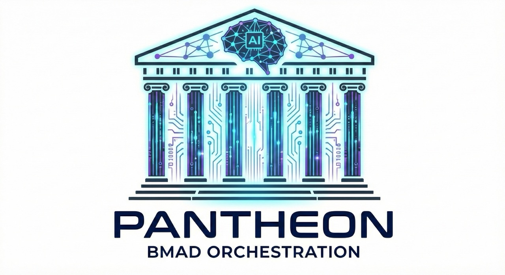

<div align="center">



**Turn Claude Code into a self-improving engineering team.**

v1.0.0

<p>
  <a href="https://github.com/sponsors/jschulte"></a>
  <a href="https://ko-fi.com/jschulte"></a>
</p>

<p>
  <a href="https://github.com/jonahschulte/pantheon/blob/main/LICENSE"></a>
  
</p>

</div>

Pantheon is a [BMAD Method](https://github.com/bmadcode/BMAD-METHOD) plugin that wraps every feature story in a structured, multi-agent pipeline — the same way a well-run engineering team operates. It works with **Claude Code** (best experience — native parallel agents and swarm support), **OpenCode**, **GitHub Copilot**, and **Codex CLI** — with specialized agents that build, review, triage, fix, and learn in parallel. The result: production-grade code, not "works on my machine" code.

---

## The Problem

AI coding assistants are fast but sloppy. You paste a story into Claude, it churns out code, and you spend the next few hours hunting down the bugs it introduced. The multi-tenant isolation is missing. The error handling is `catch { return [] }`. The tests mock everything and test nothing.

**The bottleneck isn't code generation. It's everything else** — gap analysis, multi-perspective review, test quality validation, security scanning, learning from past mistakes. Pantheon automates all of it.

---

## How It Works

Every story runs through a 7-phase pipeline with named specialist agents — the Greek Pantheon:

```
PREPARE  Load story, score and load relevant playbooks
   |
FORGE    Pygmalion creates domain-specialist reviewers on the fly
   |
BUILD    Metis (or a routed specialist) implements with TDD
   |
VERIFY   Cerberus (security), Argus (inspector), Nemesis (tests),
   |      Hestia (architecture) review in parallel
   |
ASSESS   Themis triages findings — real bug or style nit?
   |
REFINE   Builder fixes MUST_FIX issues in its own context (no re-explaining)
   |
REFLECT  Hermes extracts learnings, updates playbooks for next time
```

Each agent has a clear role boundary. Builders build. Reviewers review. The arbiter triages. No "do everything at once" chaos — the structure is what makes the output reliable.

---

## What Makes Pantheon Different

### It processes entire epics, not just single prompts

The `batch-stories` workflow analyzes dependencies between stories, organizes them into parallel waves, and spawns concurrent workers — each running the full 7-phase pipeline independently.

```
Wave 1: Stories 6-1, 6-3  (no dependencies — run in parallel)
Wave 2: Stories 6-2, 6-4  (depend on Wave 1)
Wave 3: Stories 6-5, 6-6  (depend on Wave 2)
```

Hand it an epic. Walk away. Come back to production-ready code with 80%+ test coverage, multi-perspective reviews, and zero unresolved MUST_FIX issues across every story.

### It's built for Claude Code agent swarms

> **Experimental:** Swarm mode requires Claude Code's Agent Teams feature (`CLAUDE_CODE_EXPERIMENTAL_AGENT_TEAMS=1`), which is experimental and may change without notice. Sequential mode works without it.

Pantheon is designed from the ground up to work with Claude Code's multi-agent capabilities. In swarm mode, it spawns **Heracles workers** — each one an independent agent running the full story pipeline. Workers coordinate through shared task lists, claim stories automatically, and commit in parallel using a lock file protocol.

**Hygeia**, the Quality Gate Coordinator, serializes expensive checks (type-check, build, test suite) across workers with intelligent caching. When three workers all need `tsc --noEmit`, Hygeia runs it once and serves cached results — keeping your machine responsive while agents build in parallel.

### It gets smarter with every story

Most AI coding tools are stateless. Every conversation starts from zero. Pantheon learns.

The **playbook system** creates a compound learning loop:

1. Story 1 runs → reviewers find 37 issues → 5 patterns extracted → playbooks updated
2. Story 2 loads those playbooks → avoids 7 of those issues before writing a line of code
3. By Epic 8, issues decline from 40+/story to under 10

Playbooks are scored for relevance (domain overlap, file patterns, historical hit rate) and loaded under a token budget. High-performing playbooks get loaded first. Low-performers get deprioritized. A **compaction protocol** keeps playbooks dense with value (3-10KB) rather than bloated with repetition.

This is operational knowledge extracted from real code reviews and fed forward into real implementations — on your specific codebase, with your specific patterns.

### Every finding requires evidence

No more "looks good to me" or vague "consider adding error handling." Every reviewer must provide **file:line citations** for every finding. Every task verification must cite the exact code that satisfies it. If you can't point to the line, it doesn't count.

### It routes complexity intelligently

A copy change doesn't deserve the same pipeline as a payment integration. Pantheon's 6-tier complexity engine automatically selects the right review depth:

| Tier | Review Mode | When |
|------|-------------|------|
| Trivial | Inline checks | Static content, config |
| Micro-Light | Consolidated (4-in-1) | Simple components, basic CRUD |
| Standard | Consolidated (4-in-1) | API integration, forms |
| Complex | Parallel reviewers | Auth, migrations, database |
| Critical | Maximum scrutiny | Encryption, PII, credentials |

80% of stories use consolidated review (saving ~25K tokens each). The remaining 20% get full parallel scrutiny where it matters.

---

## Workflows

### `/story-pipeline` — Implement a single story

Run the full 7-phase pipeline on one story. Builder selection is automatic — React stories get the frontend specialist, API stories get the TypeScript specialist, database work gets the Prisma specialist.

```bash
/story-pipeline story_key=17-1
```

### `/batch-stories` — Implement an entire epic

Process all stories in an epic with dependency-aware wave parallelism. Sequential or swarm mode.

```bash
/batch-stories epic=17                 # Sequential
/batch-stories epic=17 mode=parallel   # Parallel swarm
```

### `/batch-review` — Harden existing code

Deep multi-perspective review of existing implementations. Run repeatedly with different focuses until bulletproof.

```bash
/batch-review epic=17                              # General sweep
/batch-review epic=17 focus="security"             # Security audit
/batch-review epic=17 focus="accessibility"        # WCAG compliance
/batch-review path="src/api" focus="performance"   # Targeted optimization
```

### `/plan-team-sprint` — Plan work for a real team

Interactive sprint planner that takes your epics, architecture, and team composition and produces an optimized execution plan. Builds a dependency DAG, computes parallel work streams, identifies risk zones (file conflicts), and generates coordination checkpoints. Supports rebalancing mid-sprint when plans change.

### `/detect-ghost-features` — Find undocumented functionality

Reverse gap analysis that scans your codebase for components, endpoints, models, and services that have no corresponding story. Generates backfill story proposals with effort estimates.

### `/create-story-with-gap-analysis` — Generate stories from your codebase

Interactive story generation with systematic codebase scanning. Auto-populates all 12 BMAD sections with verified file references.

---

## The Agents

### Builders (auto-routed by story content)

| Agent | Specialty | Triggers |
|-------|-----------|----------|
| **Metis** | General purpose | Fallback |
| **Helios** | React / Next.js | `*.tsx`, "component", "UI" |
| **Hephaestus** | TypeScript API | `api/**/*.ts`, "endpoint" |
| **Athena** | Database / Prisma | `prisma/**`, "migration" |
| **Atlas** | Infrastructure | `*.tf`, "deploy", "CI/CD" |
| **Pythia** | Python | `*.py`, "FastAPI", "Django" |
| **Gopher** | Go | `*.go`, "goroutine" |

### Reviewers

| Agent | Focus | Included |
|-------|-------|----------|
| **Cerberus** | Security | Always |
| **Hestia** | Architecture | Always |
| **Argus** | Task verification (file:line evidence) | Always |
| **Nemesis** | Test quality (meaningful assertions, not just coverage) | Always |
| **Apollo** | Logic / Performance | Backend stories |
| **Arete** | Code quality | Complex+ stories |
| **Iris** | Accessibility | Frontend stories |

### Support

| Agent | Role |
|-------|------|
| **Themis** | Triages findings — real issues get fixed, style nits get filtered |
| **Hermes** | Reflection + reporting — extracts learnings, updates playbooks |
| **Pygmalion** | Forges domain-specialist reviewers per story |
| **Hygeia** | Coordinates quality gates across parallel swarm workers |

---

## Installation

1. Clone this repo somewhere on your machine:
   ```bash
   git clone https://github.com/jonahschulte/pantheon.git ~/git/pantheon
   ```

2. In your target project, run the BMAD installer:
   ```bash
   npx bmad-method install
   ```

3. When the installer asks if you have any **custom local workflows or agents**, point it to the `src` folder in this repo:
   ```
   ~/git/pantheon/src
   ```

That's it. The installer will wire Pantheon's agents and workflows into your project alongside the rest of BMAD.

Pantheon works on multiple AI coding platforms, with Claude Code as the primary target:

| Platform | Parallel Agents | Full Features |
|----------|----------------|---------------|
| **Claude Code** | Native | Yes |
| **OpenCode** | Manual | Yes |
| **GitHub Copilot** | Auto | Yes |
| **Codex CLI** | Sequential | Yes |

---

## Configuration

In your project's config:

```yaml
pantheon:
  coverage_threshold: 80          # Minimum test coverage %
  require_code_citations: true    # file:line evidence required
  enable_playbooks: true          # Compound learning system
  bootstrap_mode: true            # Auto-init playbooks from codebase
  enable_batch_processing: true
  parallel_config:
    max_concurrent: 3             # Stories per wave
    smart_ordering: true          # Auto-detect dependencies
  use_consolidated_review: "auto" # Complexity-based routing
```

---

## What You Get

**For a 10-story epic:**

| | Traditional | Pantheon |
|---|---|---|
| Time | ~70 developer-days | ~16 hours |
| Test coverage | 40-60% | 85%+ |
| Review perspectives | 1 (maybe) | 4-6 per story |
| Security scan | Sometimes | Every story |
| Knowledge captured | Tribal, lossy | Playbooks, persistent |
| Consistency | Varies by reviewer | Same rigor every time |

---

## How the Playbook System Works

Playbooks are structured knowledge files that capture patterns, gotchas, and anti-patterns learned from real code reviews on your codebase.

**Before building**, the pipeline scores playbooks for relevance:
- Domain overlap (does the playbook cover this story's domain?)
- File pattern match (does it apply to the files being changed?)
- Historical hit rate (did it actually prevent issues last time?)

**After building**, the reflection agent:
- Extracts new patterns from the review cycle
- Merges overlapping entries with existing playbooks
- Replaces stale entries with updated guidance
- Compacts to stay within 3-10KB per playbook

**The result:** Each playbook has structured metadata tracking which stories contributed to it, how many times it's been loaded, and its effectiveness rate. The more stories you run, the fewer issues your builder produces.

---

## Project Structure

```
pantheon/
├── src/
│   ├── module.yaml               # Module definition
│   ├── agent-routing.yaml        # Builder/reviewer routing rules
│   ├── agents/
│   │   ├── builders/             # Domain-specific builder personas
│   │   ├── reviewers/            # Specialist reviewer personas
│   │   ├── validators/           # Verification agents
│   │   └── support/              # Triage, reflection, coordination
│   ├── schemas/                  # JSON schemas for agent artifacts
│   ├── workflows/
│   │   ├── story-pipeline/       # Core 7-phase implementation
│   │   ├── batch-stories/        # Epic-level batch orchestration
│   │   ├── batch-review/         # Hardening workflow
│   │   ├── plan-team-sprint/     # Sprint planning
│   │   ├── detect-ghost-features/# Reverse gap analysis
│   │   └── ...                   # Additional workflows
│   └── adapters/                 # Multi-platform support
│       ├── opencode/
│       ├── copilot/
│       └── codex/
└── docs/
    └── specialist-registry/      # Forged specialist personas
```

---

## Requirements

- **Node.js** 18+
- **Git**
- **Claude Code** (primary) or another supported AI coding platform
- **BMAD Method** v6.0.0+ (for story format and module system)

> **Note:** Workflow and agent files reference `@patterns/` (e.g., `@patterns/tdd.md`, `@patterns/verification.md`). These are resolved by the BMAD Method installer from the parent framework's shared patterns library. They are not included in this repository. If you see unresolved `@patterns/` references, ensure BMAD Method v6.0.0+ is installed in your project.

---

## License

MIT

---

**Author:** Jonah Schulte
