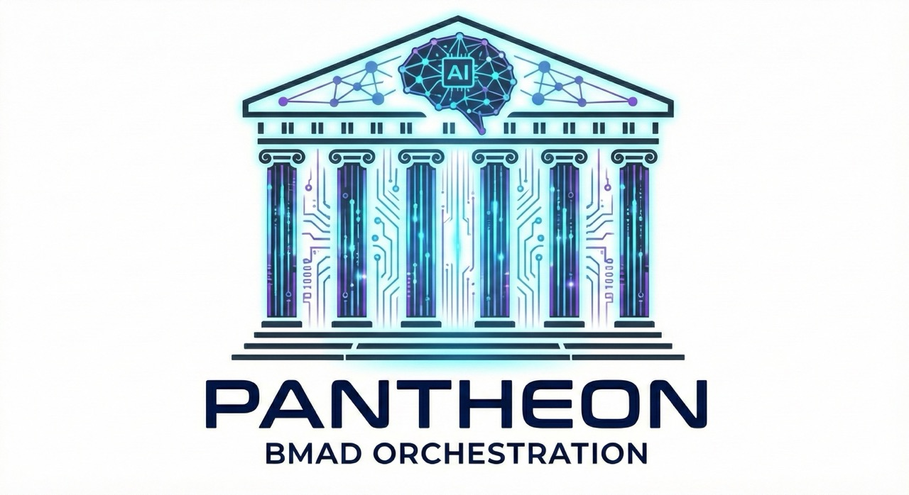
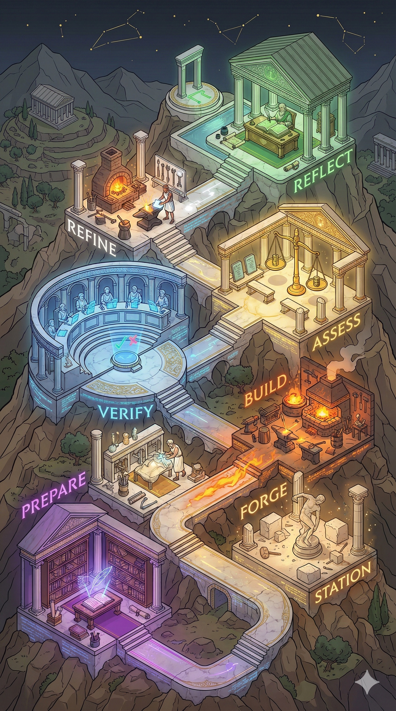
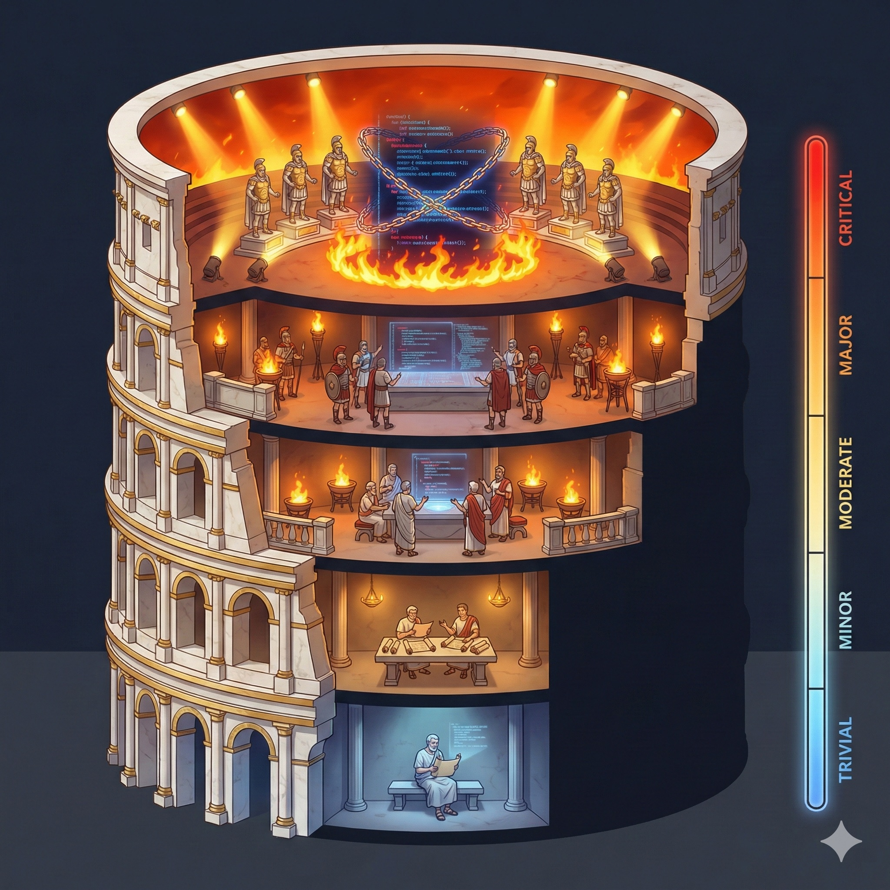
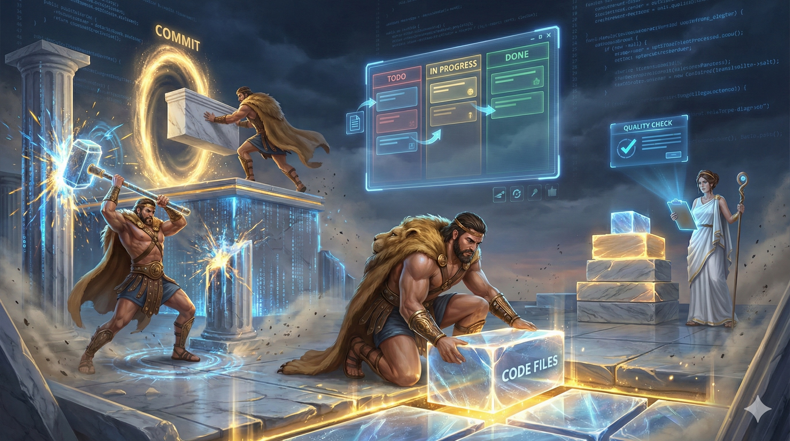
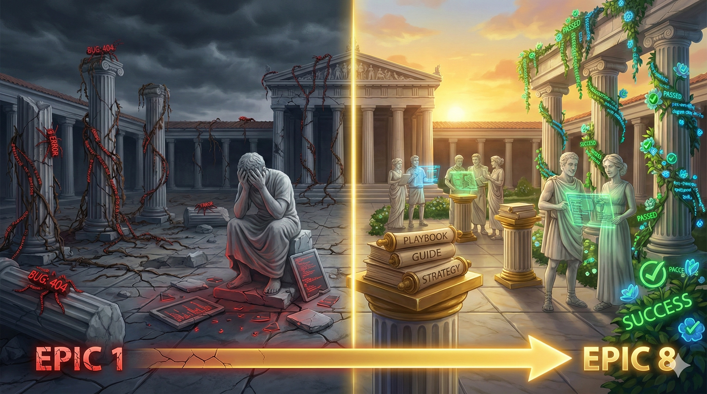
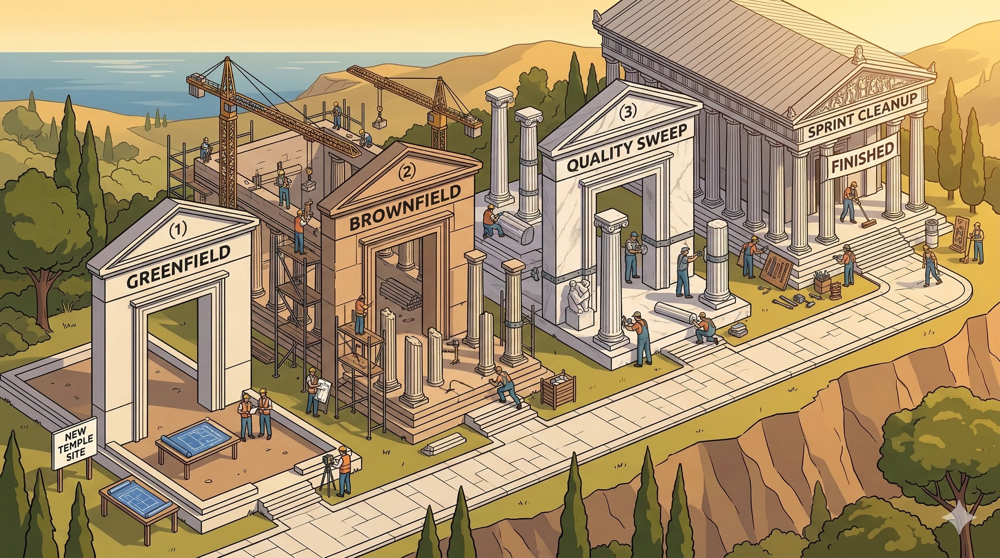

<div align="center">

<picture>
  <source media="(prefers-color-scheme: dark)" srcset="images/pantheon-logo-dark-mode.jpg">
  <source media="(prefers-color-scheme: light)" srcset="images/pantheon-logo.jpg">
  
</picture>

**Turn Claude Code into a self-improving engineering team.**

</div>

Pantheon is a [BMAD Method](https://github.com/bmadcode/BMAD-METHOD) plugin that wraps every feature story in a structured, multi-agent pipeline — the same way a well-run engineering team operates. It works with **Claude Code** (best experience — native parallel agents and swarm support), **OpenCode**, **GitHub Copilot**, and **Codex CLI** — with specialized agents that build, review, triage, fix, and learn in parallel. The result: production-grade code, not "works on my machine" code.

---

## The Problem

AI coding assistants generate code fast, but speed without structure leaves gaps — missing validations, shallow error handling, tests that don't exercise real behavior. BMAD workflows address this, but they're only as good as the story is thorough and require numerous commands and back-and-forth to get through a single story. When you have dozens of epics and hundreds of stories, orchestrating agents through the right steps, in the right sequence, for the right stories, with proper quality gates — it becomes tedious and time-consuming to manage by hand.

<div align="center">

</div>

**Pantheon automates all of it** — gap analysis, multi-perspective review, test quality validation, security scanning, and learning from past mistakes — across entire epics in a single command.

---

## How It Works

Every story runs through an 8-phase pipeline with named specialist agents — the Greek Pantheon:

```
PREPARE  Load story, score and load relevant playbooks
   |
FORGE    Pygmalion creates domain-specialist reviewers on the fly
   |
BUILD    Metis (or a routed specialist) implements — code only, no tests
   |
TEST     Aletheia writes adversarial tests independently (bug loop: max 3 rounds)
   |
VERIFY   Cerberus (security gate), Argus (inspector), Nemesis (tests),
   |      Hestia (architecture) review in parallel
   |
ASSESS   Themis triages findings — real bug or style nit?
   |
REFINE   Builder fixes MUST_FIX issues in its own context (no re-explaining)
   |
COMMIT   Charon handles git operations with user scope selection
   |
REFLECT  Hermes extracts learnings, updates playbooks for next time
```

<div align="center">

</div>

Each agent has a clear role boundary. Builders build. Testers test (separately). Reviewers review. The arbiter triages. No "do everything at once" chaos — the structure is what makes the output reliable.

---

## What Makes Pantheon Different

### It processes entire epics or even entire projects, not just single stories or prompts

The `batch-stories` workflow analyzes dependencies between stories, organizes them into parallel waves, and spawns concurrent workers — each running the full 8-phase pipeline independently.

```
Wave 1: Stories 6-1, 6-3  (no dependencies — run in parallel)
Wave 2: Stories 6-2, 6-4  (depend on Wave 1)
Wave 3: Stories 6-5, 6-6  (depend on Wave 2)
```

Hand it an epic. Walk away. Come back to production-ready code with 80%+ test coverage (configurable), multi-perspective reviews, and zero unresolved MUST_FIX issues across every story.

### It's built for Claude Code agent swarms

> **Experimental:** Swarm mode can optionally use Claude Code's Agent Teams feature (`CLAUDE_CODE_EXPERIMENTAL_AGENT_TEAMS=1`), which is experimental and may change without notice. Without it, swarm mode still works using standard Task tool subagent coordination.

Pantheon is designed from the ground up to work with Claude Code's multi-agent capabilities. In swarm mode, it spawns **Heracles workers** — each one an independent agent running the full story pipeline. Workers coordinate through shared task lists, claim stories automatically, and commit in parallel using a lock file protocol.

**Hygeia**, the Quality Gate Coordinator, serializes expensive checks (type-check, build, test suite) across workers. When three workers all need `tsc --noEmit`, they queue up and Hygeia runs it once against the current filesystem — then serves the same fresh result to all waiting workers. No caching, no stale results — just serialized execution with batch notification, keeping your machine responsive while agents build in parallel.

### It gets smarter with every story

Most AI coding tools are stateless. Every conversation starts from zero. Pantheon learns.

The **playbook system** creates a compound learning loop:

1. Story 1 runs → reviewers find 37 issues → 5 patterns extracted → playbooks updated
2. Story 2 loads those playbooks → avoids 7 of those issues before writing a line of code
3. By Epic 8, issues decline from 40+/story to under 10

Playbooks are scored for relevance (domain overlap, file patterns, historical hit rate) and loaded under a token budget. High-performing playbooks get loaded first. Low-performers get deprioritized. A **compaction protocol** keeps playbooks dense with value (3-10KB) rather than bloated with repetition.

This is operational knowledge extracted from real code reviews and fed forward into real implementations — on your specific codebase, with your specific patterns.

### Security is a first-class gate, not an afterthought

Cerberus is an **independent security gate** — not a regular reviewer. Its BLOCK findings stop the pipeline. No agent, no orchestrator, and no triage process can override a BLOCK.

Every review runs through three tiers:

1. **Deterministic secrets scanner** — 11 regex patterns (AWS keys, GitHub/Slack/Stripe tokens, JWTs, private keys, connection strings) via a portable shell script. No LLM guessing — regex catches `AKIA[0-9A-Z]{16}` every time.
2. **Enterprise MCP policies** (when available) — connects to a security MCP server for live policies, ADRs, severity thresholds, and automated scanning tools. Security team updates policies centrally; every project picks them up immediately.
3. **Bundled policy fallback** — 10 policy files (OWASP Top 10, 7 ADRs, severity config) and 2 review playbooks ship with Pantheon. When no MCP server is configured, Cerberus uses these automatically — same enterprise-grade review, just not centrally managed.

### Every finding requires evidence

No more "looks good to me" or vague "consider adding error handling." Every reviewer must provide **file:line citations** for every finding. Every task verification must cite the exact code that satisfies it. If you can't point to the line, it doesn't count.

### It routes complexity intelligently

A copy change doesn't deserve the same pipeline as a payment integration. Pantheon's 6-tier complexity engine automatically selects the right review depth:

| Tier | Review Mode | When |
|------|-------------|------|
| Trivial | Inline checks | Static content, config |
| Micro-Light | Consolidated (4-in-1) | Simple components, basic CRUD |
| Standard | Consolidated (4-in-1) | API integration, forms |
| Complex | Parallel reviewers | Auth, migrations, database |
| Critical | Maximum scrutiny | Encryption, PII, credentials |

<div align="center">

</div>

80% of stories use consolidated review (saving ~25K tokens each). The remaining 20% get full parallel scrutiny where it matters.

---

## Commands Reference

All commands are invoked as slash commands. On **Claude Code**, type them directly. On **GitHub Copilot**, prefix with `@workspace`. On **Codex CLI**, load the corresponding instruction file first.

### Core Implementation

#### `/story-pipeline` — Implement a single story

Run the full 8-phase pipeline on one story. Builder selection is automatic — React stories get the frontend specialist, API stories get the TypeScript specialist, database work gets the Prisma specialist.

```bash
# Implement a specific story
/story-pipeline story_key=17-1

# Implement with explicit builder override
/story-pipeline story_key=17-1 builder=helios
```

**What happens:**
1. **PREPARE** — Loads story, scores playbooks for relevance, loads top matches
2. **FORGE** — Pygmalion analyzes the domain and forges specialist reviewers if needed
3. **BUILD** — Routed builder implements (tests first via TDD, then production code)
4. **TEST** — Aletheia writes adversarial tests independently (bug loop: max 3 rounds)
5. **VERIFY** — Parallel reviewers (Argus, Nemesis, Cerberus, Hestia, + conditionals) examine the work
6. **ASSESS** — Themis triages findings into MUST_FIX / SHOULD_FIX / STYLE
7. **REFINE** — Builder fixes all MUST_FIX issues
8. **COMMIT** — Charon handles git commit with scope selection
9. **REFLECT** — Mnemosyne extracts learnings into playbooks

**Output artifacts** (in `_bmad-output/sprint-artifacts/completions/`):
- `17-1-metis.json` — Builder completion report
- `17-1-argus.json` — Inspector verification with file:line evidence
- `17-1-nemesis.json` — Test quality analysis
- `17-1-cerberus.json` — Security scan results
- `17-1-hestia.json` — Architecture review
- `17-1-themis.json` — Triage decisions
- `17-1-mnemosyne.json` — Reflection / playbook updates

---

#### `/batch-stories` — Implement entire epic(s)

Process all stories in one or more epics with dependency-aware wave parallelism. Validates stories, scores complexity, builds a dependency DAG, and executes in waves.

```bash
# Implement all stories in epic 17 (sequential)
/batch-stories epic=17

# Parallel swarm mode (spawns Heracles workers)
/batch-stories epic=17 mode=parallel

# Multiple epics in one run
/batch-stories Epics 17-23

# Specific stories only
/batch-stories stories="17-1,17-3,17-5"

# Resume a failed batch (skips completed stories)
/batch-stories epic=17 resume=true
```

**What happens:**
1. Loads `sprint-status.yaml`, filters to target epic(s)
2. Validates all story files exist and parse correctly
3. Scores complexity for each story (determines review depth)
4. Analyzes inter-story dependencies, builds wave ordering
5. Executes stories wave-by-wave (sequential or parallel)
6. Generates session report with per-story metrics

**Example wave output:**
```
Wave 1: 17-1 (DB schema), 17-3 (shared types)     → parallel, no deps
Wave 2: 17-2 (API endpoints), 17-4 (auth middleware) → depends on Wave 1
Wave 3: 17-5 (UI components)                        → depends on Wave 2
```

<div align="center">

</div>

---

#### `/quick-feature` — Plan-to-build in one command

Go from a feature idea to implemented stories without manual BMAD workflow orchestration. Automates the entire planning chain (PRD, architecture, epics, sprint-status, stories) then hands off to `batch-stories`.

```bash
# From a plan file
/quick-feature plan=docs/feature-plan.md

# From inline description
/quick-feature "Add user authentication with OAuth2 and JWT tokens"

# With StackShift brownfield onboarding (auto-detected)
/quick-feature plan=docs/feature-plan.md
```

**User interaction points (only 2):**
1. **CLARIFY** — Targeted multiple-choice questions (4-12 based on plan detail)
2. **POST-EPICS** — Epic selection + build mode (sequential/parallel)

Everything else runs autonomously.

---

#### `/plan-to-story` — Add work to existing BMAD trail

Lighter than `quick-feature` — assumes a BMAD document trail already exists and adds to it. Three modes handle different entry points:

```bash
# Pre-build: turn a plan into stories before implementing
/plan-to-story plan=docs/new-feature.md

# Post-build: retroactively document already-built work
/plan-to-story plan=docs/what-we-built.md mode=post-build

# Sweep: find undocumented work in recent commits
/plan-to-story mode=sweep
```

| Mode | Input | Use Case |
|------|-------|----------|
| **pre-build** | A plan | Turn plan into stories before building |
| **post-build** | A plan | Retroactively document already-built work |
| **sweep** | Git history | Find undocumented work in recent commits |

---

### Review & Hardening

#### `/batch-review` — Deep multi-perspective review

Run deep code review and hardening on existing implementations. Loops until clean — SCOPE, REVIEW, ASSESS, FIX, VERIFY, REPORT. Run repeatedly with different focuses to progressively harden code.

```bash
# General review sweep of an epic
/batch-review epic=17

# Security audit
/batch-review epic=17 focus="security vulnerabilities"

# Accessibility compliance
/batch-review epic=17 focus="accessibility, WCAG AA"

# Performance optimization
/batch-review path="src/api" focus="N+1 queries, performance bottlenecks"

# UX consistency
/batch-review epic=17 focus="styling, UX, button placement consistency"

# Error handling patterns
/batch-review path="src/services" focus="error handling consistency"

# Review across multiple epics
/batch-review Epics 17-23

# Specific stories
/batch-review stories="17-1,17-3"
```

**Hardening loop:**
```
SCOPE  → Identify files and focus area
REVIEW → Multi-perspective analysis (Cerberus, Argus, Nemesis, Hestia)
ASSESS → Themis triages findings
FIX    → Builder addresses MUST_FIX items
VERIFY → Re-review to confirm fixes
REPORT → Summary with metrics
  ↑______↓ (loops until clean or max iterations reached)
```

**Output artifacts** (in `_bmad-output/sprint-artifacts/hardening/`):
- `{scope}-review.json` — Raw review findings
- `{scope}-triage.json` — Triage decisions
- `{scope}-fixes.json` — Fix log
- `{scope}-report.md` — Human-readable summary
- `{scope}-history.json` — Iteration history

---

#### `/ux-audit` — Design consistency audit

Harmonia ensures every page feels like it belongs to the same system. Two modes:

```bash
# Bootstrap: extract patterns from existing app, create Design Language Reference
/ux-audit mode=bootstrap

# Audit: compare pages against established DLR
/ux-audit

# Targeted audit after major UI changes
/ux-audit path="src/components/checkout"

# Story-scoped (automatic in pipeline for frontend stories)
/ux-audit story_key=17-3
```

**Bootstrap mode** (no DLR exists):
- Scans UI components, pages, and styles
- Extracts interaction patterns, visual language, layout conventions
- Produces a Design Language Reference document

**Audit mode** (DLR exists):
- Compares each page/component against the DLR
- Reports inconsistencies across 6 areas: interaction patterns, visual language, layout, feedback/state, navigation, content/voice
- Findings classified: MUST_FIX (breaks mental model) / SHOULD_FIX (friction) / CODE_HEALTH (systemic) / STYLE (trivial)

---

### Analysis & Planning

#### `/detect-ghost-features` — Find undocumented functionality

Reverse gap analysis: scans your codebase for components, endpoints, models, and services that have no corresponding story. The opposite of "is the story implemented?" — this asks "is the code documented?"

```bash
# Scan everything against all stories
/detect-ghost-features

# Scope to a specific epic
/detect-ghost-features epic=17

# Scan and auto-generate backfill story proposals
/detect-ghost-features create_backfill=true
```

**What it scans for:**
- React components without story coverage
- API endpoints not tracked in any story
- Database tables/models with no documentation
- Services and utilities that appeared without stories

**Severity levels:**
- **Critical** — APIs, auth, payment (undocumented = high risk)
- **High** — Components, DB tables, services
- **Medium** — Utilities, helpers
- **Low** — Config files, constants

---

#### `/create-story-with-gap-analysis` — Generate stories from codebase

Interactive story generation with systematic codebase scanning. Every checkbox reflects reality — files are verified to exist, stubs are detected, test coverage is checked.

```bash
# Create a new story with verified gap analysis
/create-story-with-gap-analysis epic=17 story="Add user profile page"

# Regenerate an existing story with fresh verification
/create-story-with-gap-analysis story_key=17-3
```

**Verification status per task:**
- `[x]` — File exists, real implementation, tests exist
- `[~]` — File exists but is a stub/TODO or missing tests
- `[ ]` — File does not exist

---

#### `/gap-analysis` — Verify story claims against code

Validate story checkbox claims against actual codebase reality. Finds false positives (checked but not done) and false negatives (done but unchecked).

```bash
# Verify a single story
/gap-analysis story_key=17-1

# Verify and auto-update checkboxes to match reality
/gap-analysis story_key=17-1 auto_update=true

# Strict mode (stubs count as incomplete)
/gap-analysis story_key=17-1 strict=true
```

---

#### `/revalidate-story` — Fresh verification from scratch

Clears all checkboxes and re-verifies each item against the actual codebase. Detects over-reported completion and identifies real gaps. Optionally fills gaps.

```bash
# Revalidate a story (report only)
/revalidate-story story_key=17-1

# Revalidate and fill gaps (implement missing items)
/revalidate-story story_key=17-1 fill_gaps=true

# Revalidate with a cap on how many gaps to fill
/revalidate-story story_key=17-1 fill_gaps=true max_gaps=5
```

---

#### `/plan-execution` — Plan work for a real team

Give it your epics, architecture, and team composition. It builds a dependency DAG across every story, maps stories to architecture domains, and computes optimal parallel work streams.

```bash
# Plan for a 4-person team
/plan-execution team_size=4

# Greenfield project planning
/plan-execution team_size=3 project_type=greenfield

# Mid-project rebalancing (reads sprint-status.yaml to filter completed work)
/plan-execution team_size=4 rebalance=true
```

**Output includes:**
- **Execution phases** — Foundation, Fan-out, Steady State, Convergence
- **Per-developer work streams** — stories grouped by domain, balanced by effort
- **Coordination checkpoints** — explicit handoff points between developers
- **Risk zones** — files touched by multiple developers, with mitigation strategies
- **Mermaid dependency graph** — visual DAG with color coding and critical path

---

### Maintenance & Ops

#### `/story-closer` — Close out nearly-complete stories

Scans all story files for unchecked tasks, autonomously executes remaining work, reviews quality, and updates artifacts. Designed to run at scale across 100+ stories.

```bash
# Scan and close stories across the project
/story-closer

# Target a specific epic
/story-closer epic=17
```

**Triage rules:**
- 0 unchecked tasks → skip (already done)
- ≤30% unchecked → story-closer handles it (lightweight flow)
- >30% unchecked → routes to full `/story-pipeline`

---

#### `/tech-debt-burndown` — Convert tracked issues into stories

Harvests issues from `tracked-issues.json` (populated by `/batch-review` and `/batch-stories`), clusters them by root cause, and generates BMAD story files.

```bash
# Harvest and process all tracked issues
/tech-debt-burndown

# Filter to a specific type
/tech-debt-burndown type=security

# Filter to a specific epic's issues
/tech-debt-burndown epic=17
```

**Phases:**
1. **HARVEST** — Collect issues from local index or GitHub Issues
2. **ANALYZE** — Root-cause clustering, deduplication, effort estimation
3. **PROPOSE** — Interactive: approve, edit, skip, or merge proposals
4. **CREATE** — Generate BMAD story files, mark source issues as addressed

---

#### `/playbook-migration` — Upgrade legacy playbooks

One-time migration utility for repos with existing playbooks. Converts legacy format to v1 standardized format, bootstraps the index, and backfills learnings from historical pipeline artifacts.

```bash
# Run migration (safe to re-run — idempotent)
/playbook-migration

# Dry run to preview changes
/playbook-migration dry_run=true
```

---

## The Agents

### Builders (auto-routed by story content)

| Agent | Specialty | Triggers |
|-------|-----------|----------|
| **Metis** | General purpose | Fallback |
| **Helios** | React / Next.js | `*.tsx`, "component", "UI" |
| **Hephaestus** | TypeScript API | `api/**/*.ts`, "endpoint" |
| **Athena** | Database / Prisma | `prisma/**`, "migration" |
| **Atlas** | Infrastructure | `*.tf`, "deploy", "CI/CD" |
| **Pythia** | Python | `*.py`, "FastAPI", "Django" |
| **Gopher** | Go | `*.go`, "goroutine" |

<div align="center">

</div>

### Reviewers

| Agent | Focus | Included |
|-------|-------|----------|
| **Cerberus** | Independent security gate (BLOCK/WARN severity) | Always — runs secrets scanner + policy review |
| **Hestia** | Architecture | Always |
| **Argus** | Task verification (file:line evidence) | Always |
| **Nemesis** | Test quality (meaningful assertions, not just coverage) | Always |
| **Apollo** | Logic / Performance | Backend stories |
| **Arete** | Code quality | Complex+ stories |
| **Iris** | Accessibility | Frontend stories |

### Specialist Forging

| Agent | Role |
|-------|------|
| **Pygmalion** | Forges domain-specialist reviewers per story. Uses Jaccard similarity against a specialist registry — REUSE (>=0.5), EVOLVE (0.3-0.49), or FORGE_NEW (<0.3). Each forged specialist gets a Greek mythology name. |

<div align="center">

</div>

### Support

| Agent | Role |
|-------|------|
| **Themis** | Triages findings — MUST_FIX / SHOULD_FIX / STYLE. Quick Fix Rule: if fixable in < 2 minutes, it's always MUST_FIX. |
| **Aletheia** | Adversarial test writer — writes tests independently from builder |
| **Charon** | Self-governed git operations — commit, PR, scope selection |
| **Mnemosyne** | Reflection + playbook management — extracts learnings, updates/creates playbooks |
| **Hermes** | Session reporter — generates comprehensive batch completion summaries |
| **Harmonia** | UX design audit — bootstraps Design Language Reference or audits against it |
| **Hygeia** | Coordinates quality gates across parallel swarm workers |

---

## Installation

1. Clone this repo somewhere on your machine:
   ```bash
   git clone git@ghe.coxautoinc.com:DDC-AI/pantheon.git ~/git/pantheon
   ```

2. In your target project, run the BMAD installer:
   ```bash
   npx bmad-method install
   ```

3. When the installer asks if you have any **custom local workflows or agents**, point it to the `src` folder in this repo:
   ```
   ~/git/pantheon/src
   ```

That's it. The installer will wire Pantheon's agents and workflows into your project alongside the rest of BMAD.

### Platform Compatibility

Pantheon agents and workflows are defined as `.agent.yaml` and `workflow.yaml` files. BMAD's IDE manager auto-generates platform-specific launchers (Claude Code skills, Copilot skills, OpenCode agents, etc.) from these canonical definitions.

---

## Configuration

In your project's `_bmad/pantheon/config.yaml` (ships with good defaults, modify as needed):

```yaml
pantheon:
  coverage_threshold: 80          # Minimum test coverage %
  require_code_citations: true    # file:line evidence required
  enable_playbooks: true          # Compound learning system
  bootstrap_mode: true            # Auto-init playbooks from codebase
  enable_batch_processing: true
  parallel_config:
    max_concurrent: 3             # Stories per wave
    smart_ordering: true          # Auto-detect dependencies
  use_consolidated_review: "auto" # Complexity-based routing

# External tracker integration (optional)
tracker:
  provider: none  # "rally", "github", or "none" (auto-detected at runtime)
```

---

## What You Get

**For a 10-story epic:**

| | Traditional | Pantheon |
|---|---|---|
| Time | ~70 developer-days | ~16 hours |
| Test coverage | 40-60% | 85%+ |
| Review perspectives | 1 (maybe) | 4-6 per story |
| Security scan | Sometimes | Every story |
| Knowledge captured | Tribal, lossy | Playbooks, persistent |
| Consistency | Varies by reviewer | Same rigor every time |

---

## How the Playbook System Works

Playbooks are structured knowledge files that capture patterns, gotchas, and anti-patterns learned from real code reviews on your codebase.

**Before building**, the pipeline scores playbooks for relevance:
- Domain overlap (does the playbook cover this story's domain?)
- File pattern match (does it apply to the files being changed?)
- Historical hit rate (did it actually prevent issues last time?)

**After building**, the reflection agent:
- Extracts new patterns from the review cycle
- Merges overlapping entries with existing playbooks
- Replaces stale entries with updated guidance
- Compacts to stay within 3-10KB per playbook

<div align="center">

</div>

**The result:** Each playbook has structured metadata tracking which stories contributed to it, how many times it's been loaded, and its effectiveness rate. The more stories you run, the fewer issues your builder produces.

---

## Typical Workflows

### Greenfield: New project, new feature

```bash
# 1. Describe what you want to build
/quick-feature "Add user authentication with OAuth2, JWT tokens, and role-based access control"

# 2. Answer 4-12 clarifying questions
# 3. Select which epics to build and mode (sequential/parallel)
# 4. Walk away — Pantheon handles the rest
```

### Brownfield: Add feature to existing codebase

```bash
# 1. Create stories from your plan, integrated with existing BMAD trail
/plan-to-story plan=docs/new-feature-plan.md

# 2. Implement the stories
/batch-stories epic=18

# 3. Harden with focused reviews
/batch-review epic=18 focus="security"
/batch-review epic=18 focus="accessibility"
```

<div align="center">

</div>

### Quality sweep: Harden what's already built

```bash
# 1. Find undocumented code
/detect-ghost-features create_backfill=true

# 2. Run multi-pass hardening
/batch-review epic=17 focus="security vulnerabilities"
/batch-review epic=17 focus="N+1 queries, performance"
/batch-review epic=17 focus="error handling consistency"

# 3. Convert accumulated issues into stories
/tech-debt-burndown
```

### Sprint cleanup: Close out remaining work

```bash
# 1. Find and close nearly-done stories
/story-closer

# 2. Revalidate completion claims
/revalidate-story story_key=17-1

# 3. Verify what's really done vs what checkboxes say
/gap-analysis story_key=17-2 auto_update=true
```

---

## Project Structure

```
pantheon/
├── src/
│   ├── module.yaml               # Module definition
│   ├── config.yaml               # Default configuration
│   ├── agent-routing.yaml        # Builder/reviewer routing rules
│   ├── agents/
│   │   ├── builders/             # Domain-specific builder personas
│   │   ├── reviewers/            # Specialist reviewer personas (incl. Cerberus security gate)
│   │   ├── validators/           # Verification agents
│   │   └── support/              # Triage, reflection, commit (Charon), coordination
│   ├── skills/                   # Platform-portable skill definitions (SKILL.md)
│   ├── schemas/                  # JSON schemas for agent artifacts
│   ├── tools/
│   │   └── scan-secrets.sh       # Deterministic secrets scanner (11 regex patterns)
│   ├── workflows/
│   │   ├── story-pipeline/       # Core 8-phase implementation
│   │   │   └── data/security/    # Bundled security policies + playbooks
│   │   ├── batch-stories/        # Epic-level batch orchestration
│   │   ├── batch-review/         # Hardening workflow
│   │   ├── quick-feature/        # Plan-to-build pipeline
│   │   ├── plan-to-story/        # Lightweight BMAD trail integration
│   │   ├── plan-execution/       # Team execution planning
│   │   ├── detect-ghost-features/# Reverse gap analysis
│   │   ├── gap-analysis/         # Story verification against codebase
│   │   ├── create-story-with-gap-analysis/  # Verified story generation
│   │   ├── revalidate-story/     # Fresh re-verification
│   │   ├── story-closer/         # Close nearly-complete stories at scale
│   │   ├── tech-debt-burndown/   # Issue-to-story conversion
│   │   ├── ux-audit/             # Design consistency (Harmonia)
│   │   ├── playbook-migration/   # Legacy playbook upgrade
│   │   └── multi-agent-review/   # Parallel review coordination
├── scripts/
│   ├── validate-all-stories.sh   # Pre-batch story validation
│   └── sanitize-story.sh         # Story file sanitization
└── docs/
    ├── specialist-registry/      # Forged specialist personas
    ├── adrs/                     # Architecture Decision Records
    ├── TROUBLESHOOTING.md        # Common issues and solutions
    ├── PLATFORM-MIGRATION.md     # Cross-platform migration guide
    └── PHASE-FLOWCHART.md        # Pipeline flow visualization
```

---

## Quick Reference

| Command | Purpose | Example |
|---------|---------|---------|
| `/story-pipeline` | Implement one story (8-phase) | `/story-pipeline story_key=17-1` |
| `/batch-stories` | Implement entire epic(s) | `/batch-stories epic=17 mode=parallel` |
| `/quick-feature` | Plan-to-build in one command | `/quick-feature "Add OAuth2 auth"` |
| `/plan-to-story` | Add work to existing BMAD trail | `/plan-to-story plan=docs/plan.md` |
| `/batch-review` | Deep multi-perspective review | `/batch-review epic=17 focus="security"` |
| `/ux-audit` | Design consistency audit | `/ux-audit mode=bootstrap` |
| `/detect-ghost-features` | Find undocumented code | `/detect-ghost-features epic=17` |
| `/create-story-with-gap-analysis` | Generate verified stories | `/create-story-with-gap-analysis epic=17` |
| `/gap-analysis` | Verify story vs codebase | `/gap-analysis story_key=17-1` |
| `/revalidate-story` | Fresh re-verification | `/revalidate-story story_key=17-1` |
| `/plan-execution` | Plan team work streams | `/plan-execution team_size=4` |
| `/story-closer` | Close nearly-done stories | `/story-closer epic=17` |
| `/tech-debt-burndown` | Issues → stories | `/tech-debt-burndown` |
| `/playbook-migration` | Upgrade legacy playbooks | `/playbook-migration dry_run=true` |

---

## Requirements

- **Node.js** 18+
- **Git**
- **Claude Code** (primary) or another supported AI coding platform
- **BMAD Method** v6.0.0+ (for story format and module system)

> **Note:** Workflow and agent files reference `@patterns/` (e.g., `@patterns/tdd.md`, `@patterns/verification.md`). These are resolved by the BMAD Method installer from the parent framework's shared patterns library. They are not included in this repository. If you see unresolved `@patterns/` references, ensure BMAD Method v6.0.0+ is installed in your project.

---

## License

MIT

---

**Author:** Jonah Schulte
