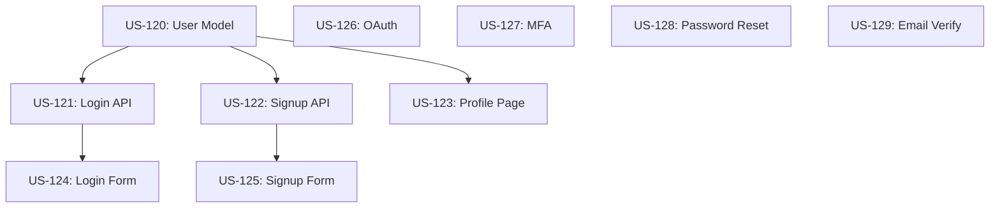

# Enterprise Scaling: Rally-Driven Development

## Overview

Pantheon's enterprise scaling solution enables 12+ developers to work in parallel with minimal conflicts through Rally integration, dependency analysis, and smart workstream planning.

---

## Architecture

```
┌─────────────────────────────────────────────────────────────────┐
│                    RALLY (Source of Truth)                       │
│  ┌──────────┐  ┌──────────┐  ┌──────────┐  ┌──────────┐       │
│  │ Epic 17  │  │ Epic 18  │  │ Epic 19  │  │ Epic 20  │       │
│  │ 10 stories│  │  8 stories│  │ 15 stories│  │  6 stories│       │
│  └──────────┘  └──────────┘  └──────────┘  └──────────┘       │
└─────────────────────────────────────────────────────────────────┘
                              ↓ (sync)
┌─────────────────────────────────────────────────────────────────┐
│              Local Rally Cache (.bmad/rally-cache/)              │
│  ├── epics.json              # Epic metadata                     │
│  ├── stories/                # Story cache by epic               │
│  │   ├── epic-17/           # All stories for epic 17           │
│  │   │   ├── US-123.json    # Rally data + BMAD format          │
│  │   │   └── US-124.json                                        │
│  │   └── epic-18/                                               │
│  ├── assignments.json        # Story locks/assignments          │
│  ├── dependencies.json       # Computed dependency graph        │
│  └── workstreams.json        # Planned parallel lanes           │
└─────────────────────────────────────────────────────────────────┘
                              ↓ (use)
┌─────────────────────────────────────────────────────────────────┐
│                      BMAD Workflows                              │
│  /rally-sync             # Pull from Rally                      │
│  /rally-checkout         # Lock story in Rally                  │
│  /rally-analyze-deps     # Build dependency graph               │
│  /rally-plan-workstreams # Generate parallel lanes              │
│  /story-pipeline         # Run with Rally sync                  │
│  /batch-stories          # Check locks, update Rally            │
└─────────────────────────────────────────────────────────────────┘
                              ↓ (update)
┌─────────────────────────────────────────────────────────────────┐
│                  Rally Status Updates                            │
│  On story start:  → "In Progress" + Locked By                   │
│  On completion:   → "Code Review" + unlock + add commit links   │
│  On merge:        → "Completed" + add coverage stats            │
└─────────────────────────────────────────────────────────────────┘
```

---

## Enterprise Workflows

### 1. Rally Sync - Pull Work Items

**Command:** `/rally-sync`

**What it does:**
1. Connects to Rally API (via MCP server)
2. Pulls all epics in specified projects/iterations
3. For each epic, pulls all user stories
4. Converts Rally format → BMAD story format
5. Caches locally in `.bmad/rally-cache/`
6. Updates assignments.json with current story locks

**Rally Story → BMAD Story Mapping:**

```yaml
Rally Field               → BMAD Section
─────────────────────────────────────────────────
FormattedID               → Story key (US-123)
Name                      → Title
Description               → Business Context
Acceptance Criteria       → Acceptance Criteria
Tasks                     → Implementation Tasks
Owner                     → Assigned To
State                     → Status (In Progress, etc.)
Custom Field: LockedBy    → Lock tracking
Custom Field: Branch      → Git branch name
Custom Field: Coverage    → Test coverage %
Custom Field: CommitSHA   → Verification link
```

**Usage:**
```bash
# Sync all epics in current project
/rally-sync project=DDC-AI

# Sync specific epic
/rally-sync epic=17

# Sync with force refresh (ignore cache)
/rally-sync epic=17 force=true
```

**Output:**
```
Rally Sync Complete
━━━━━━━━━━━━━━━━━━━━━━━━━━━━━━━━━━━━━━━━━━━━━━━
✅ Epic 17: User Authentication (10 stories)
   ├─ 8 stories ready (Defined, not locked)
   ├─ 2 stories in progress (locked by other devs)
   │  ├─ US-123: Locked by john.doe@example.com
   │  └─ US-124: Locked by jane.smith@example.com
   └─ 0 stories completed

✅ Epic 18: API Integration (8 stories)
   ├─ 5 stories ready
   ├─ 2 stories in progress
   └─ 1 story completed

Cache updated: .bmad/rally-cache/
Next: Run /rally-analyze-deps to find parallel work
```

---

### 2. Rally Checkout - Lock a Story

**Command:** `/rally-checkout`

**What it does:**
1. Checks if story is available (not locked)
2. Updates Rally custom field "LockedBy" with your email
3. Updates Rally State to "In Progress"
4. Creates git branch (e.g., `story/US-123-login-form`)
5. Updates local assignments.json
6. Pulls story details into local story file

**Locking Mechanism:**

Rally Custom Fields (created by sync):
- **LockedBy** (String): Email of developer
- **LockedAt** (DateTime): Timestamp
- **LockExpiry** (DateTime): Auto-unlock after 24 hours
- **Branch** (String): Git branch name

**Usage:**
```bash
# Check out next available story
/rally-checkout epic=17

# Check out specific story
/rally-checkout story=US-123

# Check out with custom lock duration
/rally-checkout story=US-123 lock_hours=48
```

**Output:**
```
Story Checkout Successful
━━━━━━━━━━━━━━━━━━━━━━━━━━━━━━━━━━━━━━━━━━━━━━━
Story: US-123 - Implement Login Form
Epic:  17 - User Authentication

✅ Locked in Rally (expires in 24 hours)
✅ Status updated: Defined → In Progress
✅ Branch created: story/US-123-implement-login-form
✅ Local cache updated

Ready to start:
  /story-pipeline story=US-123
```

**Conflict Handling:**
```
❌ Story Already Locked
━━━━━━━━━━━━━━━━━━━━━━━━━━━━━━━━━━━━━━━━━━━━━━━
Story: US-123 - Implement Login Form
Locked by: john.doe@example.com
Locked at: 2026-02-02 10:30 AM
Expires:   2026-02-03 10:30 AM

Available alternatives in Epic 17:
  1. US-125 - Add password reset flow (similar complexity)
  2. US-126 - Implement OAuth integration (higher complexity)
  3. US-127 - Add MFA support (similar complexity)

Checkout alternative story:
  /rally-checkout story=US-125
```

---

### 3. Rally Analyze Dependencies

**Command:** `/rally-analyze-deps`

**What it does:**
1. Reads all stories in epic(s)
2. Analyzes file paths, acceptance criteria, tasks
3. Identifies dependencies:
   - **File conflicts**: Stories touching same files
   - **Functional dependencies**: Story B needs Story A done first
   - **Test dependencies**: Shared test fixtures
   - **Data dependencies**: Database migrations
4. Builds dependency graph
5. Computes "independence score" for each story
6. Saves to `.bmad/rally-cache/dependencies.json`

**Dependency Detection Rules:**

```yaml
File Conflict:
  - Story A modifies src/auth/login.ts
  - Story B modifies src/auth/login.ts
  → CONFLICT (must sequence)

Functional Dependency:
  - Story A: "Create user model"
  - Story B: "Add user profile page" (mentions user model)
  → DEPENDS (B blocks on A)

Database Dependency:
  - Story A: Migration to add users table
  - Story B: Migration to add user_sessions table (foreign key)
  → DEPENDS (B blocks on A)

API Contract Dependency:
  - Story A: "Create POST /api/users endpoint"
  - Story B: "Frontend calls POST /api/users"
  → DEPENDS (B blocks on A)
```

**Usage:**
```bash
# Analyze single epic
/rally-analyze-deps epic=17

# Analyze multiple epics
/rally-analyze-deps epics="17,18,19"

# Analyze with visualization
/rally-analyze-deps epic=17 visualize=true
```

**Output:**
```
Dependency Analysis Complete
━━━━━━━━━━━━━━━━━━━━━━━━━━━━━━━━━━━━━━━━━━━━━━━
Epic 17: User Authentication (10 stories)

Dependency Graph:
  US-120 (Create user model)
    ├─▶ US-121 (Add login endpoint)
    ├─▶ US-122 (Add registration endpoint)
    └─▶ US-123 (Add profile page)

  US-121 (Add login endpoint)
    └─▶ US-124 (Implement login form)

  US-122 (Add registration endpoint)
    └─▶ US-125 (Implement signup form)

  US-126 (Add OAuth integration) ← INDEPENDENT
  US-127 (Add MFA support) ← INDEPENDENT
  US-128 (Add password reset) ← INDEPENDENT
  US-129 (Add email verification) ← INDEPENDENT

Parallelization Opportunities:
━━━━━━━━━━━━━━━━━━━━━━━━━━━━━━━━━━━━━━━━━━━━━━━
Wave 1 (Foundation - MUST GO FIRST):
  - US-120 (Create user model)

Wave 2 (Depends on Wave 1):
  - US-121 (Add login endpoint)
  - US-122 (Add registration endpoint)
  - US-123 (Add profile page)

Wave 3 (Depends on Wave 2):
  - US-124 (Implement login form)
  - US-125 (Implement signup form)

Independent (Can run anytime):
  - US-126 (Add OAuth integration)
  - US-127 (Add MFA support)
  - US-128 (Add password reset)
  - US-129 (Add email verification)

Saved to: .bmad/rally-cache/epic-17-dependencies.json

Next: Run /rally-plan-workstreams to assign to developers
```

**Mermaid Diagram (if visualize=true):**


---

### 4. Rally Plan Workstreams

**Command:** `/rally-plan-workstreams`

**What it does:**
1. Takes dependency graph from analysis
2. Considers developer count
3. Balances work across developers:
   - Similar complexity per lane
   - Minimal cross-lane dependencies
   - Similar story count
4. Suggests assignment strategy
5. Generates workstream document

**Workstream Planning Algorithm:**

```python
def plan_workstreams(stories, num_developers):
    # 1. Identify critical path (sequential dependencies)
    critical_path = compute_critical_path(stories)

    # 2. Identify independent stories
    independent = find_independent_stories(stories)

    # 3. Group by complexity tier
    micro = [s for s in independent if s.complexity == "micro"]
    standard = [s for s in independent if s.complexity == "standard"]
    complex = [s for s in independent if s.complexity == "complex"]

    # 4. Create lanes
    lanes = []
    for i in range(num_developers):
        lane = Lane(id=i, developer=None, stories=[])
        lanes.append(lane)

    # 5. Assign critical path to Lane 0 (senior dev)
    lanes[0].stories = critical_path
    lanes[0].priority = "CRITICAL PATH"

    # 6. Distribute independent stories round-robin by complexity
    # Balance: each lane gets similar total complexity score
    for story in sorted(independent, key=lambda s: s.complexity_score, reverse=True):
        lightest_lane = min(lanes[1:], key=lambda l: l.total_complexity)
        lightest_lane.add_story(story)

    return lanes
```

**Usage:**
```bash
# Plan for 12 developers
/rally-plan-workstreams epic=17 developers=12

# Plan with named developers
/rally-plan-workstreams epic=17 developers="john,jane,bob,alice"

# Plan multiple epics
/rally-plan-workstreams epics="17,18" developers=12
```

**Output:**
```
Workstream Plan Generated
━━━━━━━━━━━━━━━━━━━━━━━━━━━━━━━━━━━━━━━━━━━━━━━
Epic 17: User Authentication
12 developers, 10 stories, 3 waves

Lane 0: CRITICAL PATH (assign to senior dev)
━━━━━━━━━━━━━━━━━━━━━━━━━━━━━━━━━━━━━━━━━━━━━━━
  Wave 1:
    - US-120: Create user model (4 tasks, standard)
  Wave 2:
    - US-121: Add login endpoint (6 tasks, standard)
  Wave 3:
    - US-124: Implement login form (5 tasks, standard)

  Total: 3 stories, 15 tasks, ~6-8 hours
  Risk: HIGH (blocks other lanes)

Lane 1: Registration Flow
━━━━━━━━━━━━━━━━━━━━━━━━━━━━━━━━━━━━━━━━━━━━━━━
  Wave 2 (after US-120):
    - US-122: Add registration endpoint (5 tasks, standard)
  Wave 3:
    - US-125: Implement signup form (4 tasks, standard)

  Total: 2 stories, 9 tasks, ~4-6 hours
  Dependencies: Blocks on Lane 0 Wave 1

Lane 2: Profile Features
━━━━━━━━━━━━━━━━━━━━━━━━━━━━━━━━━━━━━━━━━━━━━━━
  Wave 2 (after US-120):
    - US-123: Add profile page (7 tasks, standard)

  Total: 1 story, 7 tasks, ~4-5 hours
  Dependencies: Blocks on Lane 0 Wave 1

Lane 3: OAuth Integration (INDEPENDENT)
━━━━━━━━━━━━━━━━━━━━━━━━━━━━━━━━━━━━━━━━━━━━━━━
  Any Wave:
    - US-126: Add OAuth integration (10 tasks, complex)

  Total: 1 story, 10 tasks, ~6-8 hours
  Dependencies: NONE (can start immediately)

Lane 4: MFA Support (INDEPENDENT)
━━━━━━━━━━━━━━━━━━━━━━━━━━━━━━━━━━━━━━━━━━━━━━━
  Any Wave:
    - US-127: Add MFA support (8 tasks, standard)

  Total: 1 story, 8 tasks, ~4-6 hours
  Dependencies: NONE (can start immediately)

Lane 5: Password Reset (INDEPENDENT)
━━━━━━━━━━━━━━━━━━━━━━━━━━━━━━━━━━━━━━━━━━━━━━━
  Any Wave:
    - US-128: Add password reset (6 tasks, standard)

  Total: 1 story, 6 tasks, ~3-5 hours
  Dependencies: NONE (can start immediately)

Lane 6: Email Verification (INDEPENDENT)
━━━━━━━━━━━━━━━━━━━━━━━━━━━━━━━━━━━━━━━━━━━━━━━
  Any Wave:
    - US-129: Add email verification (5 tasks, standard)

  Total: 1 story, 5 tasks, ~3-4 hours
  Dependencies: NONE (can start immediately)

Lanes 7-12: IDLE (no remaining stories)
━━━━━━━━━━━━━━━━━━━━━━━━━━━━━━━━━━━━━━━━━━━━━━━
  Reassign to help with Lane 0 (critical path)
  Or move to Epic 18

Summary:
━━━━━━━━━━━━━━━━━━━━━━━━━━━━━━━━━━━━━━━━━━━━━━━
Total Stories: 10
Critical Path: 3 stories (Lane 0)
Independent: 4 stories (Lanes 3-6)
Dependent: 3 stories (Lanes 1-2)

Estimated Timeline:
  Wave 1: 4-6 hours (1 story, 1 developer)
  Wave 2: 4-6 hours (4 stories, 4 developers in parallel)
  Wave 3: 4-6 hours (2 stories, 2 developers in parallel)

Total: 12-18 hours (vs 80+ hours sequential)
Speedup: 5-7x

Saved to: .bmad/rally-cache/epic-17-workstreams.json

Next Steps:
  1. Review and adjust assignments
  2. Assign Lane 0 to most experienced dev
  3. Checkout stories: /rally-checkout story=US-XXX
  4. Start implementation: /story-pipeline story=US-XXX
```

---

### 5. Rally Status Sync (Automatic)

**Triggered automatically during workflows**

**story-pipeline Integration:**
```yaml
Phase 0: PREPARE
  → Check if story is locked by you
  → If not locked, prompt to checkout first

Phase 6: COMMIT
  → Update Rally Status: In Progress → Code Review
  → Add commit SHA to Rally custom field
  → Add coverage % to Rally custom field
  → Add test results link

Phase 7: REFLECT
  → Generate Rally-compatible completion report
  → Post summary to Rally Discussion tab
```

**Rally Status Lifecycle:**
```
Defined (Story created in Rally)
    ↓ (/rally-checkout)
In Progress (Locked, developer assigned)
    ↓ (/story-pipeline completes)
Code Review (Implementation complete, awaiting review)
    ↓ (Manual PR review + merge)
Completed (Merged to main)
```

---

## Migration: Markdown → Rally

**Command:** `/rally-migrate`

**What it does:**
1. Scans local story files (`docs/stories/*.md`)
2. Parses BMAD story format
3. Creates corresponding Rally stories via API
4. Links local story to Rally story (adds FormattedID to markdown)
5. Archives local markdown (optional)

**Usage:**
```bash
# Migrate all stories
/rally-migrate epic=17 project=DDC-AI

# Migrate single story
/rally-migrate story=docs/stories/user-auth.md epic=17

# Dry run (preview only)
/rally-migrate epic=17 dry_run=true
```

**Output:**
```
Rally Migration Complete
━━━━━━━━━━━━━━━━━━━━━━━━━━━━━━━━━━━━━━━━━━━━━━━
Migrated 10 stories to Rally Epic 17

✅ US-120: Create user model
   From: docs/stories/create-user-model.md
   Rally: https://rally.example.com/US-120

✅ US-121: Add login endpoint
   From: docs/stories/add-login-endpoint.md
   Rally: https://rally.example.com/US-121

[... 8 more stories ...]

Next Steps:
  1. Archive local markdown files (backed up to .bmad/archive/)
  2. Switch to Rally-driven workflow
  3. Run /rally-sync to pull back from Rally
```

---

## Team Coordination Patterns

### Pattern 1: Wave-Based Sprints

```bash
# Sprint Planning (PO/SM)
/rally-sync project=DDC-AI iteration=Sprint-24
/rally-analyze-deps epics="17,18,19"
/rally-plan-workstreams epics="17,18,19" developers=12

# Wave 1 (Day 1-2): Critical Path Stories
Developer 1: /rally-checkout story=US-120
Developer 2: /rally-checkout story=US-200 (from Epic 18)
Developer 3: /rally-checkout story=US-300 (from Epic 19)
[... implement in parallel ...]

# Wave 2 (Day 3-4): Dependent Stories (after Wave 1)
Developer 1: /rally-checkout story=US-121
Developer 2: /rally-checkout story=US-122
Developer 4: /rally-checkout story=US-201
[... implement in parallel ...]

# Wave 3 (Day 5-6): Final Stories
Developer 1: /rally-checkout story=US-124
Developer 2: /rally-checkout story=US-125
[... implement in parallel ...]
```

### Pattern 2: Continuous Flow

```bash
# Each developer pulls next available story
Developer 1:
  /rally-checkout epic=17  # Gets next available
  /story-pipeline          # Implements
  [repeat]

# System ensures no conflicts automatically
```

### Pattern 3: Specialized Lanes

```bash
# Assign lanes by expertise
/rally-plan-workstreams epic=17 developers=12 \
  lane_0=john.doe@example.com \    # Senior: Critical path
  lane_3=security@example.com \    # Security specialist
  lane_5=frontend@example.com      # Frontend specialist
```

---

## Rally MCP Server (Required)

**Install Rally MCP Server:**

```bash
npm install -g rally-mcp-server
```

**Configure in `~/.claude/mcp-settings.json`:**

```json
{
  "mcpServers": {
    "rally": {
      "command": "rally-mcp-server",
      "args": [],
      "env": {
        "RALLY_API_KEY": "your-api-key",
        "RALLY_WORKSPACE": "workspace-oid",
        "RALLY_PROJECT": "project-oid"
      }
    }
  }
}
```

**Rally Custom Fields Setup:**

Required custom fields (created once per project):

```yaml
Story Custom Fields:
  - LockedBy (String): Email of developer
  - LockedAt (DateTime): Lock timestamp
  - LockExpiry (DateTime): Auto-unlock time
  - Branch (String): Git branch name
  - Coverage (Decimal): Test coverage %
  - CommitSHA (String): Verification link
  - PantheonStatus (String): BMAD-specific status
```

---

## Configuration

Add to `_bmad/pantheon/config.yaml`:

```yaml
pantheon:
  # Rally integration
  rally_enabled: true
  rally_workspace: "12345"
  rally_project: "67890"
  rally_auto_sync: true        # Auto-sync on checkout/completion
  rally_lock_hours: 24         # Default lock duration

  # Workstream planning
  workstream_analysis: true
  max_parallel_developers: 12
  critical_path_assignment: "senior-dev@example.com"

  # Migration settings
  migrate_archive: true        # Archive markdown files after migration
  migrate_backup: ".bmad/archive/"
```

---

## Benefits

### 1. Zero Story Conflicts
- Automatic locking prevents duplicate work
- Developers know what's available in real-time

### 2. Optimized Parallelization
- Dependency analysis finds true parallel work
- Minimize merge conflicts through smart planning

### 3. Centralized Status
- Rally is source of truth
- No "where is this story?" questions
- Real-time progress visibility

### 4. Fair Work Distribution
- Algorithm balances complexity across lanes
- No developer gets stuck with all hard stories

### 5. Reduced Coordination Overhead
- System handles most coordination
- Developers focus on coding
- Clear lane ownership

---

## Example: 12-Developer Sprint

**Scenario:** Epic 17 with 30 stories, 12 developers, 2-week sprint

**Traditional Approach:**
```
Week 1: Planning meeting (4 hours)
        Manual story assignment
        Frequent conflicts
        Coordination meetings daily (1 hour × 5)
Week 2: Code review bottlenecks
        Merge conflicts
        Rework cycles

Total: ~80 hours developer time on coordination
```

**Rally-Driven BMAD Approach:**
```
Day 1:
  - /rally-sync (5 min)
  - /rally-analyze-deps (10 min)
  - /rally-plan-workstreams (5 min)
  - Review plan (30 min)
  - Developers checkout stories (5 min each)

Day 2-8: Implementation
  - Each developer runs /story-pipeline
  - Automatic Rally updates
  - Zero story conflicts (locked)
  - Minimal merge conflicts (smart lanes)

Day 9-10: Code review
  - All stories completed
  - Rally shows progress
  - PRs reviewed in parallel

Total: ~2 hours coordination time
Savings: 78 hours (98% reduction)
```

---

## Next Steps

To implement enterprise scaling:

1. **Phase 1: Rally Integration**
   - Build Rally MCP server
   - Implement `/rally-sync` workflow
   - Add custom fields to Rally

2. **Phase 2: Checkout/Lock**
   - Implement `/rally-checkout` workflow
   - Add lock expiry logic
   - Build conflict detection

3. **Phase 3: Dependency Analysis**
   - Build dependency analyzer
   - Implement graph algorithms
   - Add visualization

4. **Phase 4: Workstream Planning**
   - Build lane assignment algorithm
   - Add complexity balancing
   - Generate workstream docs

5. **Phase 5: Migration Tools**
   - Build markdown → Rally migrator
   - Add rollback capability
   - Test with pilot team

---

## Success Metrics

Track these to measure enterprise scaling success:

- **Story Conflict Rate**: % of stories checked out by multiple devs
- **Merge Conflict Rate**: % of PRs with merge conflicts
- **Coordination Time**: Hours per sprint on coordination
- **Lane Balance**: Std deviation of complexity across lanes
- **Lock Expiry Rate**: % of stories where lock expires unused
- **Parallelization Efficiency**: Actual speedup vs theoretical max

Target after implementation:
- Story conflicts: <1%
- Merge conflicts: <10%
- Coordination time: <5 hours/sprint
- Lane balance: σ < 15%
- Lock expiry: <5%
- Parallelization: 60-80% of theoretical max
